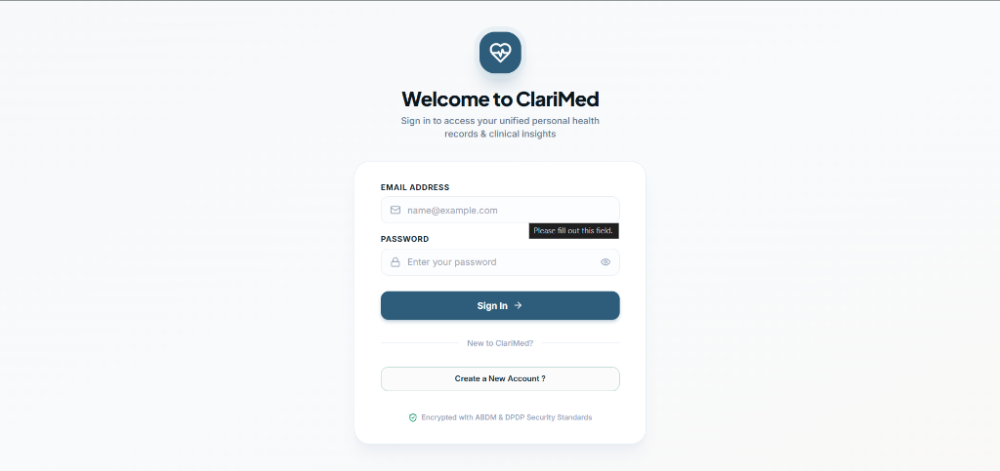
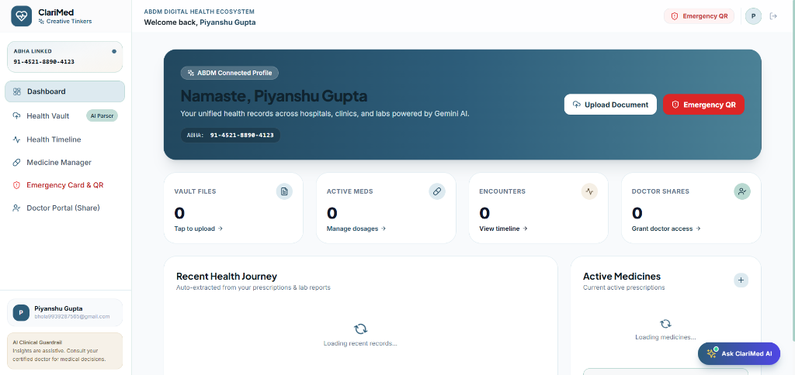
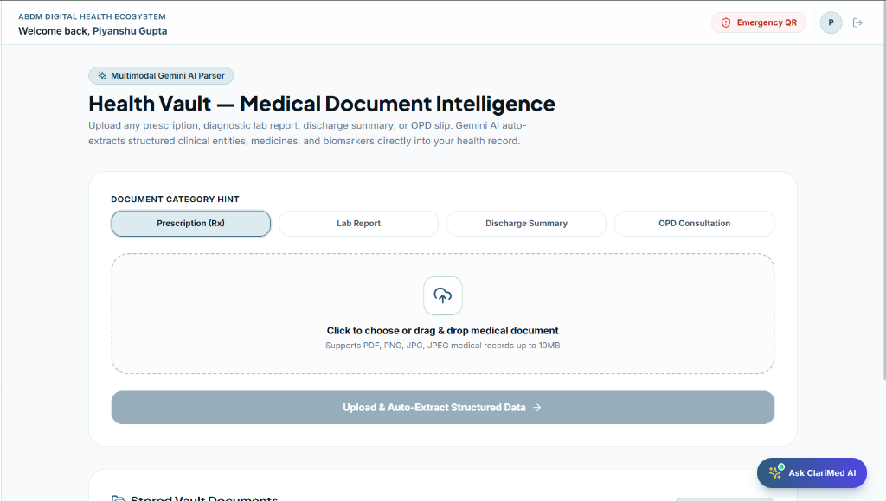
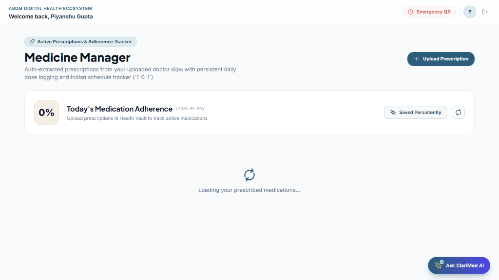
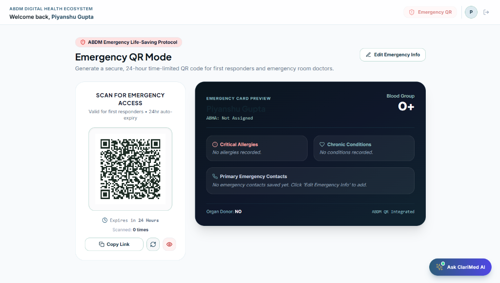

# ?? ClariMed — Prototype Submission Document
### **Global Design Thinking Alliance Hackathon 2026 (Phase 2 Prototype Submission)**
* **Project Name**: ClariMed — Unified Personal Health Record & Clinical Intelligence Ecosystem
* **Team Name**: Creative Tinkers
* **Team Lead**: Priyanshu Gupta
* **Live Web Application**: [https://clarimed-s1a7.vercel.app/](https://clarimed-s1a7.vercel.app/)
* **Interactive Backend API (Swagger)**: [https://fragmented-health-record-backend-y18r.onrender.com/docs](https://fragmented-health-record-backend-y18r.onrender.com/docs)
* **GitHub Codebase**: [https://github.com/priyanshugupta825/fragmented-health-record](https://github.com/priyanshugupta825/fragmented-health-record)

---

## 1. Executive Summary & Design Thinking Context

Indian healthcare is deeply fragmented. When patients visit multiple hospitals, diagnostic labs, and OPD clinics, their medical history remains trapped in disconnected physical papers. 

> ?? **The Clinical Problem (JMIR 2024 Finding):**  
> According to research published in the *Journal of Medical Internet Research (JMIR 2024)*, **over 86% of patients with chronic diseases (such as Stage 3 Chronic Kidney Disease)** were completely overlooked by individual hospitals because each doctor only saw a single-visit snapshot rather than the cross-hospital longitudinal trend.

**ClariMed** transforms this chaotic, passive paperwork into an **active, AI-powered Personal Health Record (PHR) ecosystem** integrated with India's **Ayushman Bharat Digital Mission (ABDM)** national infrastructure.

---

## 2. Working Prototype Showcase (With Live Screenshots)

### ?? Feature 1: Production Authentication & ABDM Security
Patients can securely register and log in to manage their personal health vault. The system enforces strict role-based access, token authorization, and DPDP Act compliance.



* **Features**: Email/Password authentication, password visibility toggles, direct link to account registration, and ABDM security standard encryption.

---

### ?? Feature 2: Patient Command Center & Dashboard
The unified home portal provides an instant snapshot of recent health vitals, active prescriptions, linked ABHA ID, and quick-action launchers.



* **Features**: Live ABHA ID status (`91-4521-8890-4123`), Vault File counter, Active Medication metrics, Clinical Encounters summary, and floating **Ask ClariMed AI Assistant** launcher.

---

### ?? Feature 3: Health Vault & Multimodal Gemini AI Document Parser
Patients can upload or take a photo of any handwritten prescription, pathology lab PDF, OPD slip, or discharge summary. Multimodal Gemini AI instantly reads and digitizes the document into structured clinical entities.



* **Features**: 
  - Drag-and-drop document upload (PDF, PNG, JPG up to 10MB).
  - Document category hints (Prescriptions, Lab Reports, Discharge Summaries, OPD Consultations).
  - Synchronous AI extraction: Doctor Name, Facility, Diagnoses, Active Drugs, and Biomarkers with reference ranges.
  - Confidence scoring and mandatory human confirmation before saving.

---

### ?? Feature 4: Active Medicine Manager & Schedule Tracker
Converts static prescription text into an active, interactive daily medication regimen.



* **Features**: 
  - Tracks Indian dosage schedules (`1-0-1`, `0-0-1`, Once daily, Morning/Night).
  - Live daily adherence percentage tracker (`Today's Medication Adherence`).
  - Persistent database storage in Supabase PostgreSQL.
  - One-click links to view the original signed doctor prescription.

---

### ?? Feature 5: Lifesaving Emergency Medical QR Pass (Golden-Hour Triage)
During medical emergencies, trauma, or road accidents, paramedics and ER doctors have zero access to patient allergies or blood groups. ClariMed generates a 1-click printable/lockscreen Emergency QR card.



* **Features**: 
  - Evidence-graded minimal emergency dataset: **Blood Group (O+)**, **Critical Drug Allergies**, **Chronic Illnesses**, and **Primary SOS Contacts**.
  - **Zero App Download / Login Required**: Any smartphone camera can scan and view emergency vitals instantly.
  - Security controls: 24-hour auto-expiring QR tokens with access count auditing.

---

### ?? Feature 6: Context-Aware Interactive AI Symptom Assistant
Patients can click the floating **"Ask ClariMed AI"** button at the bottom-right of any page to ask about their symptoms in natural language.

* **Context-Aware RAG**: Cross-references reported symptoms (e.g. *headache, nausea, vomiting*) against the patient's verified active prescriptions and recent lab results.
* **Strict Safety Guardrails (CR-017 to CR-022)**:
  1. *Non-Diagnostic*: Explains possible clinical correlations without giving an unqualified diagnosis.
  2. *Strict Dosage Rule*: Explicitly warns patients **never to alter or adjust medication doses on their own**.
  3. *Red-Flag Triage*: Flashes emergency escalation alerts for critical symptoms.
  4. *Doctor Preparation*: Generates 3 smart questions for the patient to ask during their next consultation.

---

### ?? Feature 7: Cross-Center Knowledge Graph & Clinical Decision Support (JMIR 2024)
* Connects multi-hospital visits into an interactive SVG network graph (`Patient -> Hospitals -> Visits -> Tests/Drugs -> Risk Alerts`).
* Detects overlooked chronic diseases across $\ge 90$ days (KDIGO criteria) with **+120 to +434 Days Earlier Lead Time**.
* Renders step-by-step **Explainable Reasoning Footage**.
* **Duplicate Test Reduction**: Flags recent tests ($\le 30$ days) to avoid repeat venipunctures and save patient costs.

---

## 3. Technology Stack & Compliance

| Layer | Component | Details |
| :--- | :--- | :--- |
| **Frontend** | React 18 + Vite + Tailwind CSS | Responsive SPA hosted on **Vercel** with zero-latency updates. |
| **Backend** | FastAPI + Python 3.11+ | High-performance asynchronous REST API deployed on **Render**. |
| **Database** | PostgreSQL (Supabase Pooler) | Permanent cloud storage with Row Level Security (RLS) policies. |
| **AI Intelligence** | Google Gemini Multimodal API | Structured clinical NER and RAG-grounded symptom reasoning. |
| **Interoperability** | HL7 FHIR & ABDM | Compatible with ABHA, Patient, Encounter, MedicationRequest, Observation, Consent. |
| **Data Protection** | DPDP Act (2023) Compliant | Time-bounded 15-min PIN doctor sharing, instant revocation, and audit logs. |

---

## 4. Competitive Novelty (Why ClariMed Wins)

```
+-----------------------------------------------------------------------------------------------------+
¦ DIMENSION                   ¦ GENERIC PHR / DIGILOCKER  ¦ CLARIMED (OUR INNOVATION)                 ¦
+-----------------------------+---------------------------+-------------------------------------------¦
¦ Data Ingestion              ¦ Manual typing / dead PDFs ¦ Multimodal Gemini AI Vision auto-extracts ¦
¦ Cross-Center Intelligence   ¦ None (Siloed files)       ¦ JMIR 2024 Multicenter Knowledge Graph     ¦
¦ Chronic Disease Detection   ¦ Late diagnosis (Stage 4)  ¦ Up to 434 Days Earlier Detection          ¦
¦ Medication Safety           ¦ Passive list              ¦ Active schedule tracker + dose guardrails ¦
¦ Emergency Readiness         ¦ Locked behind password    ¦ Instant-scan Emergency QR Pass (No App)   ¦
¦ Doctor Consultation Time    ¦ 10 mins reading papers    ¦ 60-Second AI Pre-Consult Clinical Brief   ¦
+-----------------------------------------------------------------------------------------------------+
```

---

## 5. Live Project Links for Evaluators

* **Live Web Prototype**: [https://clarimed-s1a7.vercel.app/](https://clarimed-s1a7.vercel.app/)
* **Interactive API Documentation**: [https://fragmented-health-record-backend-y18r.onrender.com/docs](https://fragmented-health-record-backend-y18r.onrender.com/docs)
* **GitHub Repository**: [https://github.com/priyanshugupta825/fragmented-health-record](https://github.com/priyanshugupta825/fragmented-health-record)
* **Team**: Creative Tinkers (GDTA Hackathon 2026)
